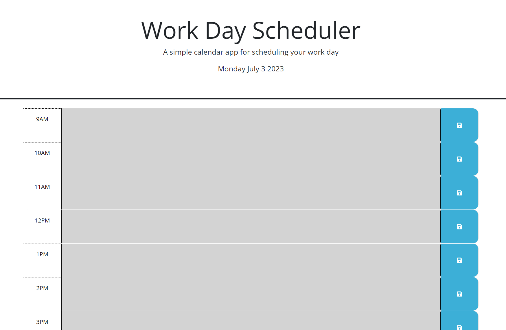

# Work-Day-Planner

## Description
The Work Day Planner is a website where users can keep track of their work day by writing notes and agenda items taking place from 9AM - 5PM.

## Installation
The website can be accessed on any browser by inputting the URL for the deployed site into the address bar. Once on the page, they will input their text into the time block rows provided. 

## Usage
Once the website can be accessed through the deployed site URL, the user will see that the current hour is highlighted in red. All hours already past are (or will turn) grey. All hours ahead in the work day are in green. The user will input any text item they need to into the time row and click the blue save button with the save icon on the right hand side. This will save the user's changes in the local storage. If the user navigates off this change or closes the page, their changes will still be there because their information has been locally saved. This also means that they will need to delete the text to empty the changes from the local storage. 

The deployed page will look like this: 

## Credits
N/A

## License
N/A